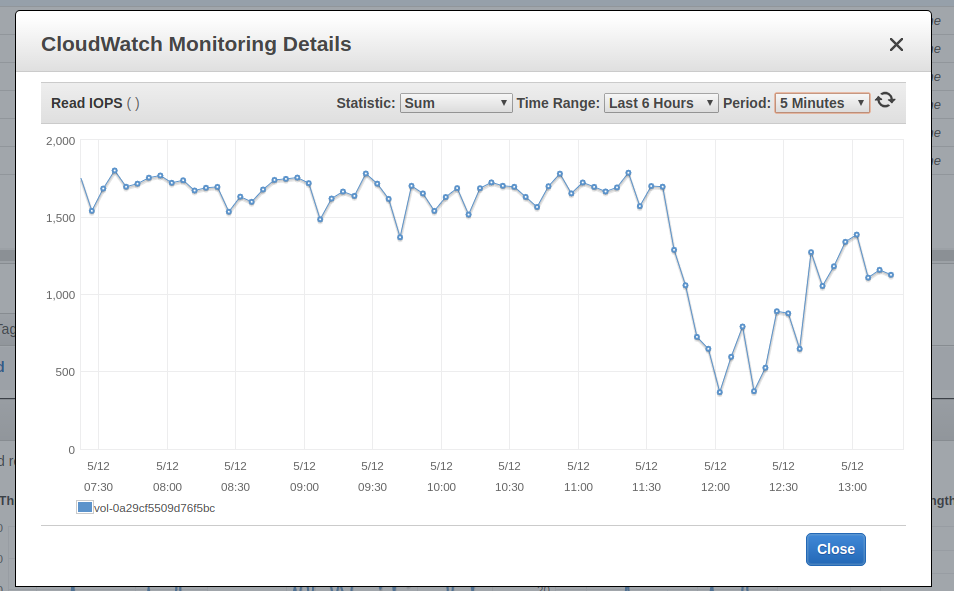
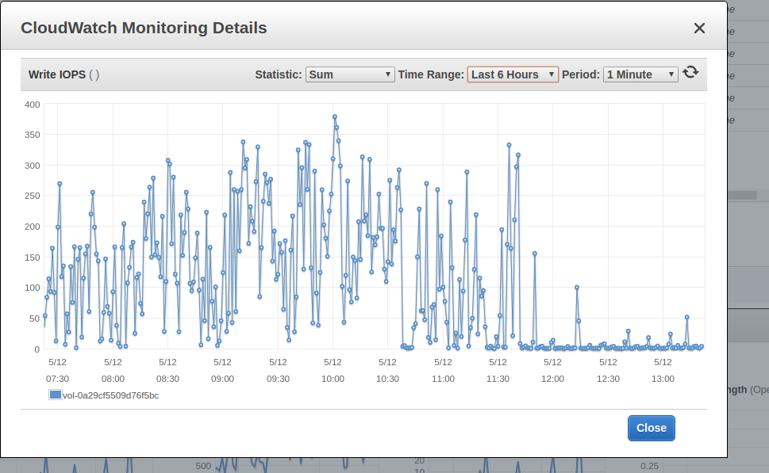
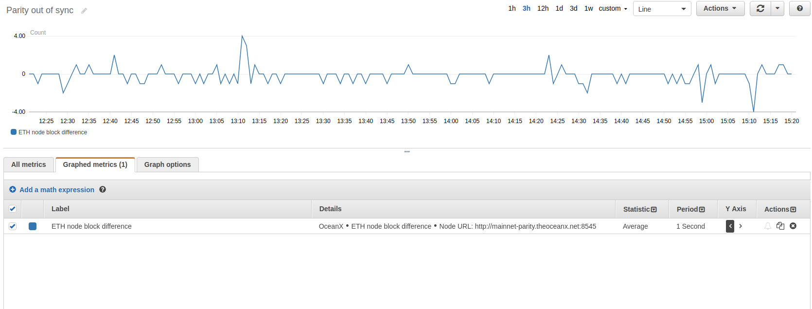

Overview
--------

AWS recently published CloudFormation templates [1]_ to launch a private Ethereum testing network.
Their solution comes with an app for viewing blocks, a miner, etc. As great as it this solution isn't easy to apply to run a mainnet node.

First, lets try to answer why would anyone need a privately hosted mainnet Ethereum node instead of relying on Infura. In Rumble Fish we have few projects where some backend component is interacting
with the Ethereum blockchain. In some cases it reacts on Event notification, in other it's responsible
for closing financial transaction and it needs to act fast.

It's never a good idea to make a business-critical process rely on external service operating well.
Whatever happens with Infura is beyond our control. If it goes down there could only wait. This may
not be a problem for many applications, in our case we had to eliminate this risk.

TL;DR summary
-------------

To just get the node up follow point below. Its assumed that you have an AWS account set up
with programmatic access.

0. Clone this repository.

   ::

     git clone https://github.com/rumblefishdev/cf-parity-mainnet.git

1. Open terminal. Install ``aws`` and ``jq`` if not installed.

2. Setup which account and region you work with.

   ::

      export AWS_DEFAULT_REGION=eu-central-1
      # set to matching entry in ~/.aws/credentials
      export AWS_DEFAULT_PROFILE=...

3. Create repository, build image and push it.

   ::

      bash build_and_upload.sh

   This command creates an ECR repository under your account and pushes there a slightly
   customized image of Parity client.

4. Specify parameters of the node.

   ::

      cd cloudformation
      cp stack-parameters.default.json stack-parameters.json
      $EDITOR stack-parameters.json

   In here you need to specify:
    - ``VpcId`` to run the chain
    - ``DNSName`` to register for your node (eg. ``mainnet.rumblefishdev.com``)

5. Create CloudFormation stack.

   ::

      bash -x create-stack

6. Go to CloudFormation console and wait for the stack creation to complete.
   Get the exported ``NameServer`` output and put it as NS entry in the DNS config of your domain.

7. Wait ~3 days for synchronization and verification process to finish.

8. Go to AWS console EC2 | Volumes section and take a volume snapshot.

9. When snapshot is ready put it as ``ChainSnapshodId`` parameters ``stack-parameters.json``
   and update the stack.

   ::

      bash -x update-stack

Challenges of running mainnet node
----------------------------------

Blockchain data persistence
&&&&&&&&&&&&&&&&&&&&&&&&&&&

The biggest challenge in getting the mainnet node up is getting it synced.
Syncing a newly connected node from zero takes 2-3 hours to get to the current blocks.
Then it takes additional 2-3 days to complete cryptographic verification process of all the blocks.
The verification process uses all available IOPS making the node not very responsive.
During this time, it's often observed that the node would fall behind by up to 30 blocks
which makes it not useful. Only after the verification process is completed the node gets
stable and can be relied on. The stacks offered by AWS don't address this problem - each node
starts with a clean slate. This is fine, as long as you don't have a lot of data  to sync
from other nodes.

Since it "costs" ~3 days to get the new node up, it's necessary to maintain data between
restarts of the node. There is surely more than one way to acomplish this. The solution we
suggest is to store the chain data on EBS drive and take a snapshot of it once
the blockchain gets fully synced. If a node gets terminated and new one takes over it will
only have to sync the blocks since the snapshot and not the whole 3 years of chain history.

Clearly its not ideal and we would prefer to have persistent data and never have to re-sync
any blocks although so far we've found ideal solution.

Approaches that we've dismissed
###############################

Single persistent EBS
+++++++++++++++++++++

One thing that we've tried was to create a persistent EBS volume outside of the context of
EC2 machine and connect it to a node on startup. This approach has it's upsides. When machine gets
terminated and a new one is spinned it starts when the other one left off. That's great feature,
because it makes the delay of re-sync minimal.

On the downside this approach doesn't play well with scaling number of instances up and down.
In a scenario where we would like to have more nodes to failover or balance the load we would
need to add additional layer to decide which EBS drive to use or possibly spawn a new one.
We've dismissed it as too complicated.

Elastic File System (EFS)
+++++++++++++++++++++++++

Another interesting attempt to solve scaling problem was using EFS. Unlike EBS it can be
connected to multiple instances which share it using NFS-like protocol. Unfortunately we've seen
that nodes with chain-data on EFS took forever to synchronize. Parity uses a lot of
IOPS and EFS offers much lower perfomance that EBS.

Public network access for synchronization layer
&&&&&&&&&&&&&&&&&&&&&&&&&&&&&&&&&&&&&&&&&&&&&&&

For the node to synchronize it needs to be able to accept connections from other nodes.
Well, to be completely strict, it's only required that one side of the connection can accept
connections so technically we could work without. However it we skipped public access than
our node could only work with nodes offering public access which eliminates big chunk of the
peer pool.

To ensure public access we've used following steps.

1. Parity is run in a docker container. Port 30303 is bridged using following part of the
   cloudformation stack.

   ::

     Resources:
       TaskDefinition:
         Type: AWS::ECS::TaskDefinition
         Properties:
           ...
           ContainerDefinitions:
             ...
             PortMappings:
               - ContainerPort: 30303
                 HostPort: 30303
                 Protocol: tcp

2. The node needs to now its public IP, as this is used as enode identifier broadcasted to
   other nodes. The solution is specific to EC2 and relies on internal API available from machine.
   From ``docker/run_parity.sh``:

   ::

      PUBLIC_IP=`curl -s http://169.254.169.254/latest/meta-data/public-ipv4`
      /parity/parity --config config.toml --nat extip:$PUBLIC_IP

3. For the port of EC2 machine to be accessible it also needs be opened in security group configuration.
   This part of the stack is responsible for doing just that.

   ::

     Resources:
       ECSSecurityGroup:
         Type: AWS::EC2::SecurityGroup
         Properties:
           ...
           SecurityGroupIngress:
             - FromPort: 30303
               ToPort: 30303
               CidrIp: 0.0.0.0/0
               IpProtocol: tcp

Private access to json-rpc and websocket endpoints
&&&&&&&&&&&&&&&&&&&&&&&&&&&&&&&&&&&&&&&&&&&&&&&&&&

Parity has two more network interfaces for accessing blockchain data.
  - port 8545 is used for json-rpc api: posting transactions and getting all sort of information
  - port 8546 can be used to receive notification from the node about new blocks and/or events

First lets discuss why we think json-rpc shouldn't be publicly available. Depending on particular
use case it may not be an issue to have json-rpc open. However at Rumble Fish we believe anything
that can be hidden should remain hidden.

Leaving json-rpc endpoint open doesn't put any funds in jeopardy. Not at least there is some
fundamental bug in Parity thats still pending to be detetected.
Nevertheless it's easy to imagine that an attacker could simply run a lot of queries on the
node just to prevent its legitimate use. Therefore we believe its worth to take extra effort to
make this part more secure.

Our approach for private access consists of the following.

1. Cloudformation stack creates and export a special SecurityGroup used for accessing the node.
   You can import it another stack using:

   ::

     !Fn::Import MainnetParity-AccessSecurityGroup

2. This group is given access to the instance using following setting in the SecurityGroup of the
   EC2 instance.

   ::

     Resources:
       ECSSecurityGroup:
         Type: AWS::EC2::SecurityGroup
         Properties:
           ...
           SecurityGroupIngress:
             - FromPort: 8545
               ToPort: 8545
               SourceSecurityGroupId: !GetAtt AccessSecurityGroup.GroupId
               IpProtocol: tcp
             - FromPort: 8546
               ToPort: 8546
               SourceSecurityGroupId: !GetAtt AccessSecurityGroup.GroupId
               IpProtocol: tcp

    These ports are routed to the docker container, similarly to what we've done before with
    port 30303.

    ::

      Resources:
        TaskDefinition:
          Type: AWS::ECS::TaskDefinition
          Properties:
            ...
            ContainerDefinitions:
              ...
              PortMappings:
                - ContainerPort: 8545
                  HostPort: 8545
                  Protocol: tcp
                - ContainerPort: 8546
                  HostPort: 8546
                  Protocol: tcp

3. Client connecting to json-rpc / websocket api need to do so by using private IP of the instance.
   We accomplish this by creating a Route53 HostedZone and registering instances IP in
   there on startup.

   Cloudformation stack exports the nameservers of this zone to be imported as

   ::

     !Fn::Import MainnetParity-NameServer

   or looked up in the AWS console exports.

   You should put this value as NS entry in the configuration of your DNS domain.

Monitoring and logging
----------------------

The stack is configured to gather interesting files from the machine and push them to CloudWatch
log stream named ``MainnetParity-logs``.

  .. image:: ./docs/images/cloudwatch-parity-logs.png
      :width: 80%
      :align: center

Sync and verification process
&&&&&&&&&&&&&&&&&&&&&&&&&&&&&

Here, the interesting bits are the files names ``/parity/parity/...`` which are the output of the
parity process. The first time you launch the stack it will use warp sync to download the blockchain
history using the bulk download protocol of Parity.

In the output it looks somewhat like this:

::

  2018-05-11T09:27:56.202Z ++ curl -s http://169.254.169.254/latest/meta-data/public-ipv4
  2018-05-11T09:27:56.253Z + PUBLIC_IP=18.196.95.41
  2018-05-11T09:27:56.253Z + /parity/parity --config config.toml --nat extip:18.196.95.41
  2018-05-11T09:27:56.297Z Loading config file from config.toml
  2018-05-11T09:27:56.350Z 2018-05-11 09:27:56 UTC Starting Parity/v1.10.3-stable-b9ceda3-20180507/x86_64-linux-gnu/rustc1.25.0
  2018-05-11T09:27:56.350Z 2018-05-11 09:27:56 UTC Keys path /root/.local/share/io.parity.ethereum/keys/Foundation
  2018-05-11T09:27:56.350Z 2018-05-11 09:27:56 UTC DB path /root/.local/share/io.parity.ethereum/chains/ethereum/db/906a34e69aec8c0d
  2018-05-11T09:27:56.350Z 2018-05-11 09:27:56 UTC Path to dapps /root/.local/share/io.parity.ethereum/dapps
  2018-05-11T09:27:56.350Z 2018-05-11 09:27:56 UTC State DB configuration: fast
  2018-05-11T09:27:56.350Z 2018-05-11 09:27:56 UTC Operating mode: active
  2018-05-11T09:27:56.361Z 2018-05-11 09:27:56 UTC Configured for Foundation using Ethash engine
  2018-05-11T09:27:56.730Z 2018-05-11 09:27:56 UTC Public node URL: enode://ec52f4ae94c624b1f8bf9c9b60fd63261beb42af6fea9d0fa4aeb6f52047fdf4afd92d9e3cd9c0f3387e892f378b3491ed8d85c38349ad50dce99539e952e38f@18.196.95.41:30303
  2018-05-11T09:27:57.057Z 2018-05-11 09:27:57 UTC Updated conversion rate to Ξ1 = US$694.89 (6852745.5 wei/gas)
  2018-05-11T09:28:06.806Z 2018-05-11 09:28:06 UTC Syncing       #0 d4e5…8fa3     0 blk/s    0 tx/s   0 Mgas/s      0+    0 Qed        #0    1/25 peers      8 KiB chain    3 MiB db  0 bytes queue   10 KiB sync  RPC:  0 conn,  0 req/s,   0 µs
  2018-05-11T09:28:16.806Z 2018-05-11 09:28:16 UTC Syncing snapshot 9/1370        #0    2/25 peers      8 KiB chain    3 MiB db  0 bytes queue   10 KiB sync  RPC:  0 conn,  0 req/s,   0 µs
  2018-05-11T09:28:21.807Z 2018-05-11 09:28:21 UTC Syncing snapshot 15/1370        #0    2/25 peers      8 KiB chain    3 MiB db  0 bytes queue   10 KiB sync  RPC:  0 conn,  0 req/s,   0 µs
  2018-05-11T09:28:26.808Z 2018-05-11 09:28:26 UTC Syncing snapshot 21/1370        #0    2/25 peers      8 KiB chain    3 MiB db  0 bytes queue   10 KiB sync  RPC:  0 conn,  0 req/s,   0 µs
  2018-05-11T09:28:31.809Z 2018-05-11 09:28:31 UTC Syncing snapshot 27/1370        #0    3/25 peers      8 KiB chain    3 MiB db  0 bytes queue   10 KiB sync  RPC:  0 conn,  0 req/s,   0 µs
  2018-05-11T09:28:36.809Z 2018-05-11 09:28:36 UTC Syncing snapshot 29/1370        #0    3/25 peers      8 KiB chain    3 MiB db  0 bytes queue   10 KiB sync  RPC:  0 conn,  0 req/s,   0 µs

The process of syncing snapshots takes about 3 hours. After the snapshots are synced Parity will download all the blocks created since last snapshot until current head of blockchain.
This phase look like this:

::

  2018-05-11T10:26:46.793Z 2018-05-11 10:26:46 UTC Syncing snapshot 1327/1370        #0   26/50 peers      8 KiB chain    3 MiB db  0 bytes queue   10 KiB sync  RPC:  0 conn,  0 req/s,   0 µs
  2018-05-11T10:26:56.798Z 2018-05-11 10:26:56 UTC Syncing snapshot 1346/1370        #0   26/50 peers      8 KiB chain    3 MiB db  0 bytes queue   10 KiB sync  RPC:  0 conn,  0 req/s,   0 µs
  2018-05-11T10:27:08.097Z 2018-05-11 10:27:08 UTC Syncing #5590000 b084…309c     0 blk/s    0 tx/s   0 Mgas/s      0+    0 Qed  #5590000   24/25 peers     63 KiB chain    1 KiB db  0 bytes queue    6 MiB sync  RPC:  0 conn,  0 req/s,   0 µs
  2018-05-11T10:27:16.794Z 2018-05-11 10:27:16 UTC Syncing #5590000 b084…309c     0 blk/s    0 tx/s   0 Mgas/s   1750+    1 Qed  #5591752   26/50 peers    174 KiB chain   39 KiB db   95 MiB queue   11 MiB sync  RPC:  0 conn,  0 req/s,   0 µs

This will take about another hour to finish this stage.

When this phase is completed the log file will change like this:

::

  2018-05-11T15:24:30.011Z 2018-05-11 15:24:30 UTC Syncing #5595608 f2fe…d003     0 blk/s    0 tx/s   0 Mgas/s      0+    7 Qed  #5595619   11/25 peers     33 MiB chain  182 MiB db    1 MiB queue    8 MiB sync  RPC:  0 conn,  0 req/s,   0 µs
  2018-05-11T15:24:41.386Z 2018-05-11 15:24:41 UTC Updated conversion rate to Ξ1 = US$679.41 (7008882.5 wei/gas)
  2018-05-11T15:24:41.795Z 2018-05-11 15:24:41 UTC Imported #5595620 ef95…d8b2 (181 txs, 7.98 Mgas, 4237.27 ms, 27.63 KiB) + another 3 block(s) containing 330 tx(s)
  2018-05-11T15:24:48.290Z 2018-05-11 15:24:48 UTC Imported #5595622 221b…509d (162 txs, 7.99 Mgas, 1194.76 ms, 25.13 KiB)
  2018-05-11T15:24:51.186Z 2018-05-11 15:24:51 UTC Imported #5595623 b744…cf9c (183 txs, 7.98 Mgas, 1698.02 ms, 33.23 KiB)
  2018-05-11T15:25:27.225Z 2018-05-11 15:25:27 UTC     #40653   13/25 peers     37 MiB chain  182 MiB db  0 bytes queue   24 MiB sync  RPC:  0 conn,  0 req/s,   0 µs
  2018-05-11T15:25:27.241Z 2018-05-11 15:25:27 UTC     #40653   13/25 peers     37 MiB chain  182 MiB db  0 bytes queue   24 MiB sync  RPC:  0 conn,  0 req/s,   0 µs
  2018-05-11T15:25:27.252Z 2018-05-11 15:25:27 UTC     #40653   13/25 peers     37 MiB chain  182 MiB db  0 bytes queue   24 MiB sync  RPC:  0 conn,  0 req/s,   0 µs
  2018-05-11T15:25:27.310Z 2018-05-11 15:25:27 UTC     #40653   13/25 peers     37 MiB chain  182 MiB db  0 bytes queue   24 MiB sync  RPC:  0 conn,  0 req/s,   0 µs
  2018-05-11T15:25:41.464Z 2018-05-11 15:25:41 UTC Imported #5595627 a4a9…9dc0 (136 txs, 7.98 Mgas, 529.92 ms, 19.68 KiB)
  2018-05-11T15:26:02.263Z 2018-05-11 15:26:02 UTC     #78637   23/25 peers     37 MiB chain  183 MiB db  241 KiB queue   22 MiB sync  RPC:  0 conn,  0 req/s,   0 µs
  2018-05-11T15:26:03.398Z 2018-05-11 15:26:03 UTC Reorg to #5595628 8fc3…7c58 (a4a9…9dc0 18c7…4d47 #5595625 f6c1…feae 3faf…012d af04…83a8)

The new type of logline starting with the block number (``#40653 ..``) comes from the process of verification of downloaded blocks. In this process Parity verifies
each block cryptographicaly and ensures that noone tampered with the data.

This process takes about 3 days too complete when run on ``t2.machine`` with gp2 EBS ``300 IOPS``. While it's running you can observe in monitoring of EBS volume that
all available IOPS are being consumed. Screenshot below represent the moment when verification process ends. You can see the difference in usage pattern.

    Read IOPS

    Write IOPS

Since the process of verification is IO bound it's possible to make it faster by provisioning the EBS drive with extra IOPS. In our CloudFormation stack
we use ``gp2`` VolumeType with the size of ``100 GB``. AWS provisions 300 baseline IOPS for such drive. If you need to make verification faster you can
modify the VolumeType to ``io1`` and give it ``1200`` IOPS. At this level we observe that verification process is no longer constrained by available
IOPS but it's missing the CPU power. Therefore you can push it to another level by changing the EC2 machine size from ``t2.medium`` to ``c5.large``.

Running on ``c5.large`` we've observed that Parity during verification uses 2000 IOPS and can finish the whole process in about 7 hours, so it's a good
shortcut if you need to have results fast. Just keep in mind that provisioned IOPS are not cheap, the monthly cost of leaving a drive of this size
and IOPS will be in range of $100, so be careful.

The idea is that once the synchronization and verification is complete you can make a snapshot and use it to restart the cluster with the
downsized disk and machine type.

Staying in sync
&&&&&&&&&&&&&&&

Once the node is fully synced and synchronized it generally stays in sync with head of the chain.

Image above presents effect of calling ``eth_blockNumber`` on our node and on Infura.
Most of the time the nodes are in sync. Ocasionally either our node or Infura falls 1-4 blocks behind.

Please note, that currently this repository doesn't include Lambda responsible for gathering
metrics above. It will be included this in future articles.

.. [1] https://docs.aws.amazon.com/blockchain-templates/latest/developerguide/blockchain-templates-ethereum.html
